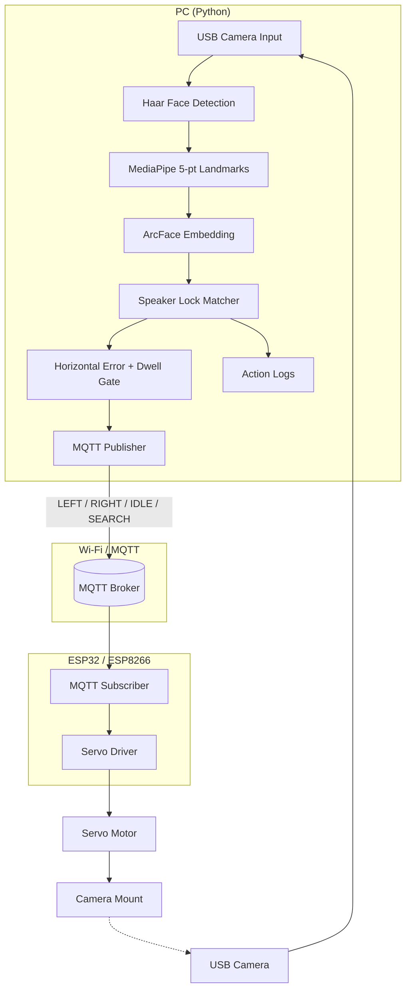
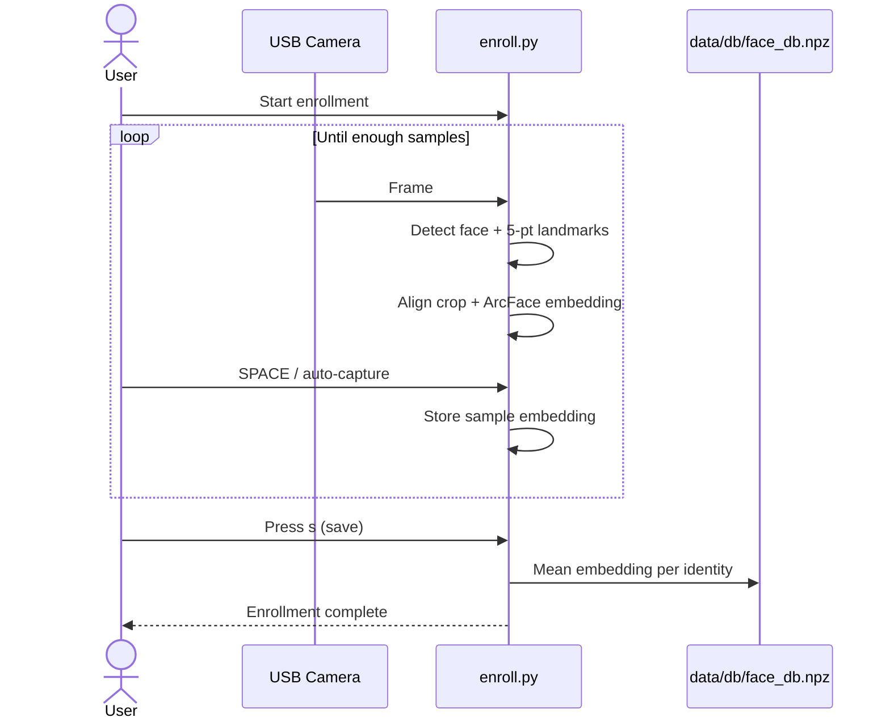
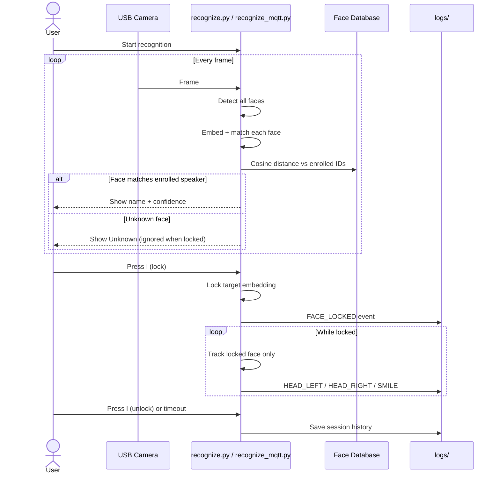
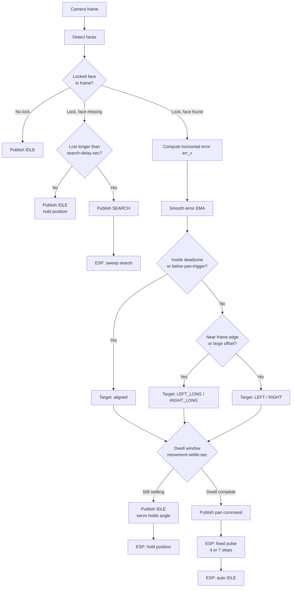
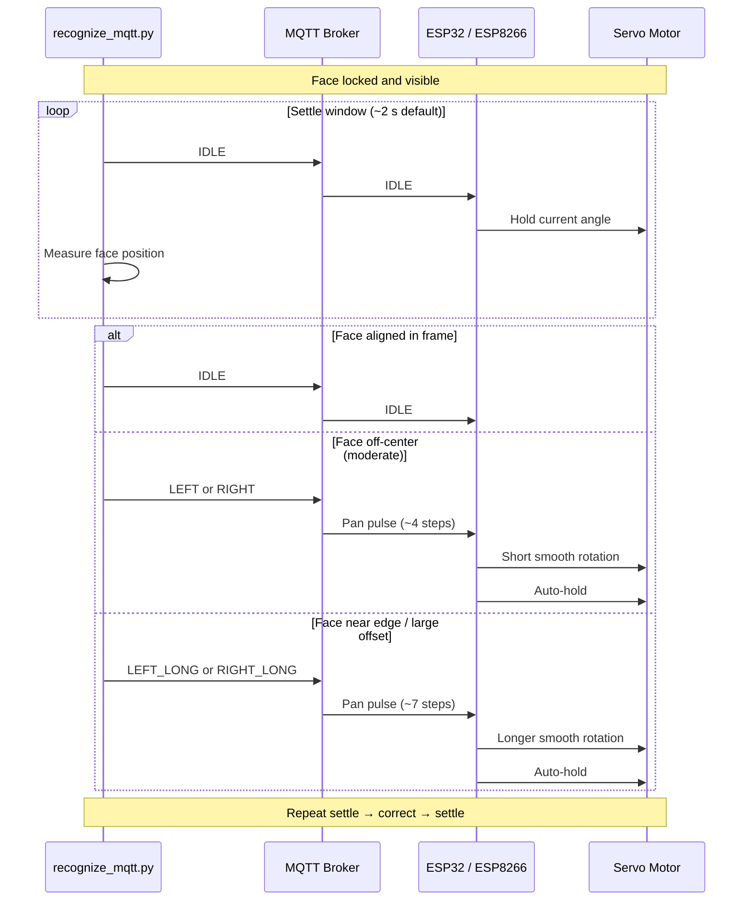
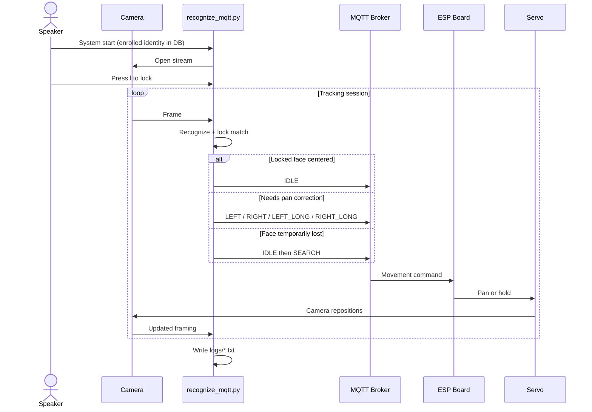

# AI-Powered Single-Speaker Face Recognition & Camera Tracking

A real-time face recognition system that **locks onto one enrolled speaker**, ignores other faces in the frame, and optionally drives a **servo-mounted camera** over **MQTT** so the speaker stays centered during live presentations, lectures, or video calls.

## System Overview

| Layer | Component | Role |
|-------|-----------|------|
| Vision | USB camera | Captures live video |
| AI (PC) | Python pipeline | Detect → recognize → lock → track → publish MQTT commands |
| Network | MQTT broker (Mosquitto on PC or cloud) | Relays movement commands |
| Embedded | ESP32 / ESP8266 | Subscribes to MQTT, drives the servo |
| Actuation | Servo motor | Pans the camera horizontally |

### Integrated architecture



## Core Features

- **Face enrollment** — capture 10–30 samples and store a reusable ArcFace embedding
- **Single-identity recognition (speaker lock)** — track only the enrolled speaker; ignore others
- **Face locking & action logging** — head movement, smiles, lock/unlock events with timestamps
- **MQTT motor control** — convert horizontal tracking error into pan commands for a servo
- **Settle-and-correct tracking** — observe for 2 s, pan once, hold, repeat (reduces jitter)
- **Re-acquisition** — brief occlusion holds position; longer loss triggers SEARCH sweep

---

## Setup

**Python:** 3.10 – 3.13 (3.14 is not supported by `onnxruntime` wheels).

```bash
pip install -r requirements.txt
```

**Models** (place in `models/`):

- `embedder_arcface.onnx`
- `face_landmarker.task`

---

## Usage

### 1. Enrollment

Capture face samples and build the speaker database.

```bash
python -m src.enroll
```

| Key | Action |
|-----|--------|
| `SPACE` | Capture one sample |
| `a` | Toggle auto-capture |
| `s` | Save to database |
| `q` | Quit |

Rebuild the database from existing crops:

```bash
python -m src.rebuild_db
```

### 2. Recognition (vision only)

```bash
python -m src.recognize
```

| Key | Action |
|-----|--------|
| `l` | Lock / unlock selected face |
| `←` / `→` | Select face when multiple detected |
| `+` / `-` | Adjust match threshold |
| `r` | Reload database |
| `d` | Debug overlay |
| `q` | Quit |

On startup, choose **DirectML** (recommended on Windows), **CUDA** (NVIDIA), or **CPU**.

### 3. Recognition + MQTT servo tracking (full system)

```bash
python addons/mqtt_servo_tracking/recognize_mqtt.py --mqtt-broker <PC_LAN_IP>
```

See [`addons/mqtt_servo_tracking/README.md`](addons/mqtt_servo_tracking/README.md) for broker setup, ESP flashing, tuning, and troubleshooting.

**Test MQTT without the camera:**

```bash
python addons/mqtt_servo_tracking/mqtt_test_publish.py --mqtt-broker <PC_LAN_IP> --command cycle
```

### 4. Evaluation & demos

```bash
python -m src.evaluate
python -m src.embed
python -m src.haar_5pt
```

---

## Sequence Diagrams

### Enrollment flow



### Recognition & speaker lock



### Recognize → Track → Command pipeline (MQTT)

This is the per-frame control path used by `recognize_mqtt.py` when a face is locked.



### Movement settle cycle (one correction)



### End-to-end integrated session



---

## MQTT + Servo Extension

Full details: [`addons/mqtt_servo_tracking/README.md`](addons/mqtt_servo_tracking/README.md)

| Item | Location / value |
|------|------------------|
| Python app | `addons/mqtt_servo_tracking/recognize_mqtt.py` |
| ESP firmware | `addons/mqtt_servo_tracking/esp8266/face_tracker_servo/face_tracker_servo.ino` |
| Upload helper | `addons/mqtt_servo_tracking/esp8266/upload.ps1` |
| MQTT test tool | `addons/mqtt_servo_tracking/mqtt_test_publish.py` |
| Broker example | PC LAN IP (e.g. `192.168.1.194`) or `broker.hivemq.com` |
| Topic example | `vision/teamalpha/movement/Jeremie` |

**MQTT payloads**

| Command | Meaning on ESP |
|---------|----------------|
| `IDLE` | Hold current servo angle |
| `LEFT` / `RIGHT` | Short pan pulse (~4°) |
| `LEFT_LONG` / `RIGHT_LONG` | Longer pan pulse (~14°) near frame edge |
| `SEARCH` | Sweep while locked face is missing |
| `CENTER` | Snap to home angle (debug only; not used in tracking) |

**Key tuning flags**

```bash
python addons/mqtt_servo_tracking/recognize_mqtt.py \
  --mqtt-broker 192.168.1.194 \
  --mqtt-topic vision/teamalpha/movement/Jeremie \
  --movement-settle-sec 2.0 \
  --deadzone-px 80 \
  --pan-trigger-px 110 \
  --edge-correction-px 120 \
  --search-delay-sec 2.0
```

---

## Face Locking & Logging

### How locking works

1. Press `l` when the enrolled speaker is recognized (use `←` / `→` if multiple faces).
2. The locked face gets an orange border; other faces are ignored for tracking.
3. Actions are logged to `logs/[Name]_history_[timestamp].txt`.
4. Lock releases on `l`, timeout (~40 s without sight), or quit.

### Log format

```
2026-06-12 15:16:45.443268 - FACE_LOCKED: Face locked: Jeremie
2026-06-12 15:16:48.640953 - HEAD_RIGHT: Moved right by 10.9px
2026-06-12 15:17:06.928153 - SMILE: Smile detected (ratio: 51.66)
```

---

## Project Structure

```
FaceLockingAndTracking/
├── src/                          # Core vision pipeline
│   ├── enroll.py                 # Speaker enrollment
│   ├── recognize.py              # Multi-face recognition + lock
│   ├── detect.py, landmarks.py, align.py
│   └── ...
├── addons/mqtt_servo_tracking/   # MQTT + servo extension
│   ├── recognize_mqtt.py         # Recognition + MQTT publishing
│   ├── mqtt_test_publish.py      # Broker / ESP test tool
│   └── esp8266/face_tracker_servo/
├── data/db/face_db.npz           # Enrolled embeddings
├── data/enroll/                  # Enrollment crops
├── logs/                         # Session action logs
└── models/                       # ONNX + MediaPipe models
```

---

## Technical Stack

| Area | Technology |
|------|------------|
| Detection | OpenCV Haar cascade (multi-face) |
| Landmarks | MediaPipe FaceMesh (5-point per ROI) |
| Recognition | ArcFace ONNX embeddings + cosine distance |
| Vision runtime | OpenCV, NumPy, ONNX Runtime (CPU / CUDA / DirectML) |
| MQTT | paho-mqtt + Mosquitto |
| Embedded | ESP32 / ESP8266, PubSubClient, Servo library |

---

## Hardware Notes

- **Servo power:** use a dedicated 5 V supply; share ground with the ESP.
- **Wi-Fi:** PC and ESP must be on the same network when using a local broker.
- **Broker binding:** Mosquitto on Windows must listen on `0.0.0.0:1883`, not only `127.0.0.1`.
- **Serial monitor:** 115200 baud for ESP debug output.
