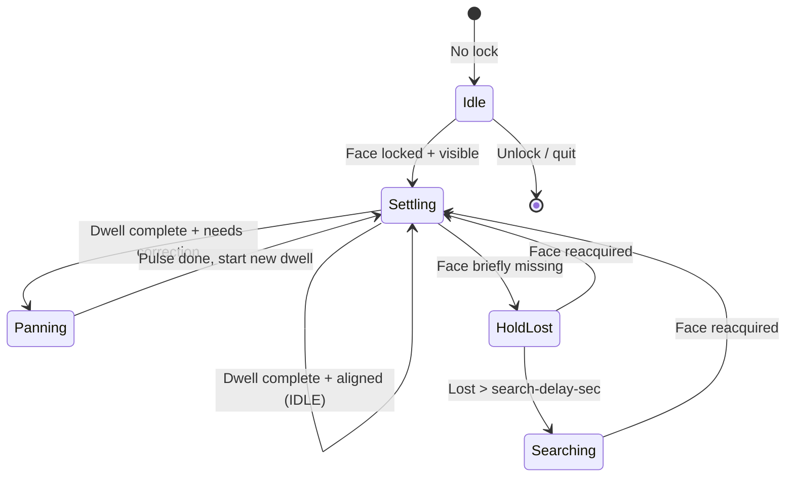

# MQTT Servo Face Tracking Extension

Extends the core `src/recognize.py` pipeline with **MQTT-based pan-tilt servo control** so a locked speaker stays centered in frame.

## Files

| File | Purpose |
|------|---------|
| `recognize_mqtt.py` | Face lock + horizontal tracking + MQTT publishing |
| `mqtt_test_publish.py` | Test broker connectivity and ESP response |
| `esp8266/face_tracker_servo/face_tracker_servo.ino` | ESP32 / ESP8266 firmware |
| `esp8266/upload.ps1` | `arduino-cli` upload helper |
| `mosquitto.local.conf.example` | Snippet for local Mosquitto on Windows |

## Control loop



## MQTT protocol

**Topic (example):** `vision/teamalpha/movement/Jeremie`

| Payload | ESP behavior |
|---------|--------------|
| `IDLE` | Hold current servo angle |
| `LEFT` / `RIGHT` | Short pan pulse (~4 smooth steps) |
| `LEFT_LONG` / `RIGHT_LONG` | Longer pulse (~7 steps) for edge / large offset |
| `SEARCH` | Sweep back and forth |
| `CENTER` | Snap to home angle (debug only) |

> During normal tracking, Python sends `IDLE` when the face is aligned — **not** `CENTER`. On the ESP, `CENTER` physically moves the servo to 90°.

## Python setup

From repo root:

```bash
pip install -r requirements.txt
python addons/mqtt_servo_tracking/recognize_mqtt.py --mqtt-broker <PC_LAN_IP>
```

### Common flags

```bash
python addons/mqtt_servo_tracking/recognize_mqtt.py \
  --mqtt-broker 192.168.1.194 \
  --mqtt-topic vision/teamalpha/movement/Jeremie \
  --movement-settle-sec 2.0 \
  --deadzone-px 80 \
  --pan-trigger-px 110 \
  --edge-correction-px 120 \
  --edge-margin-ratio 0.12 \
  --search-delay-sec 2.0 \
  --mqtt-min-interval 0.15
```

| Flag | Default | Purpose |
|------|---------|---------|
| `--movement-settle-sec` | `2.0` | Wait before each pan correction |
| `--deadzone-px` | `80` | Face considered centered inside this offset |
| `--pan-trigger-px` | `110` | Minimum offset before any pan is sent |
| `--edge-correction-px` | `120` | Use `LEFT_LONG` / `RIGHT_LONG` above this offset |
| `--edge-margin-ratio` | `0.12` | Also use long pan when face is near frame border |
| `--search-delay-sec` | `2.0` | Hold before SEARCH when face is lost |

### Stability tuning

- Raise `--pan-trigger-px` (e.g. `130`) if the servo reacts to tiny head movements.
- Raise `--movement-settle-sec` for slower, smoother corrections.
- Raise `--deadzone-px` if the face is already near center but pan keeps firing.
- Lower `--edge-correction-px` if edge faces do not pan enough.

## Local Mosquitto broker (PC)

1. Find PC LAN IP: `ipconfig` (e.g. `192.168.1.194`)
2. Add lines from [`mosquitto.local.conf.example`](mosquitto.local.conf.example) to `C:\Program Files\mosquitto\mosquitto.conf`
3. Restart service (Administrator):

```powershell
net stop mosquitto
net start mosquitto
```

4. Allow inbound TCP **1883** on Private network in Windows Firewall.
5. Verify:

```powershell
& "C:\Program Files\mosquitto\mosquitto_pub.exe" -h 192.168.1.194 -t test/local -m hello
```

6. Match broker IP in **both** Python (`--mqtt-broker`) and the `.ino` file (`MQTT_SERVER`).

## ESP setup

1. Edit `esp8266/face_tracker_servo/face_tracker_servo.ino`:
   - `WIFI_SSID`, `WIFI_PASSWORD`
   - `MQTT_SERVER` (PC LAN IP)
   - `MQTT_TOPIC` (must match Python `--mqtt-topic`)
   - `SERVO_PIN`, `REVERSE_SERVO`
2. Install libraries: `PubSubClient`, `ESP32Servo` (ESP32) or `Servo` (ESP8266)
3. Flash:

```powershell
powershell -ExecutionPolicy Bypass -File addons/mqtt_servo_tracking/esp8266/upload.ps1 -Port COM5
```

For ESP32, pass FQBN, e.g. `-Fqbn esp32:esp32:esp32`.

## Test without camera

```bash
python addons/mqtt_servo_tracking/mqtt_test_publish.py --mqtt-broker 192.168.1.194 --command cycle
```

Expected serial output: `IDLE`, `LEFT`, `RIGHT`, `LEFT_LONG`, `RIGHT_LONG`, `SEARCH`.

## Servo snap / jitter troubleshooting

| Symptom | Likely cause | Fix |
|---------|----------------|-----|
| Quick snap then stop | Old firmware used timed bursts | Re-flash: each command is a fixed step pulse |
| Twitch while serial shows `IDLE` | Weak servo power | External 5 V supply + common ground |
| Pan on tiny movement | Offset barely above deadzone | Raise `--pan-trigger-px` |
| Python connects, ESP silent | Broker only on localhost / firewall | Bind Mosquitto to `0.0.0.0`, open port 1883 |

## Wiring (reference)

| ESP | Servo |
|-----|-------|
| GPIO (e.g. pin 2) | Signal (orange) |
| GND | GND (brown) |
| — | VCC (red) → **5 V supply** (not ESP 3.3 V) |
